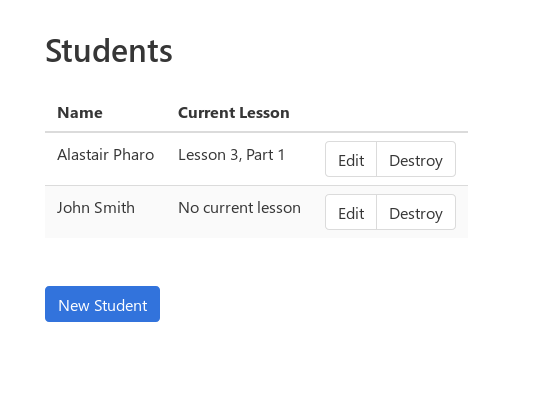
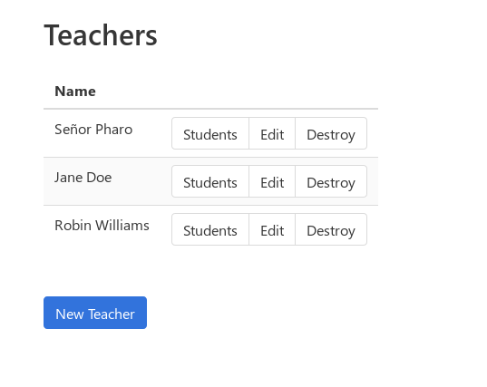
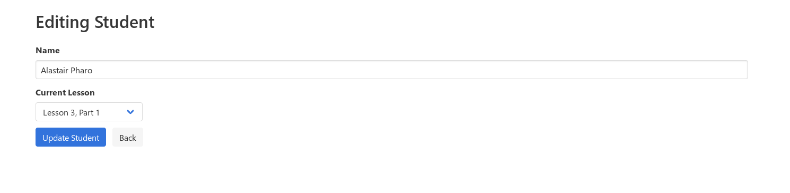
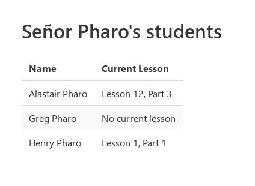
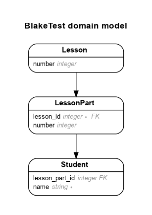
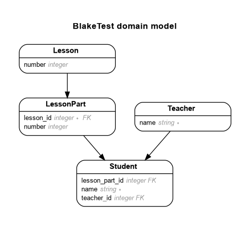

# Blake's Backend Test

This is a [Rails][rails] app for [my][me] job application with [Blake
E-Learning][blake].  The brief is as follows:

    PROBLEM
    -------
    Company X is developing a new app for student education. Students complete
    lessons and their progress is recorded.  Each lesson has 3 parts - 1, 2 and 3.
    There are 100 lessons in total.

    PART 1
    ------
    Generate an app that persists students and their progress.

    Define routes for:
    a) setting a student's progress - progress should consist of a lesson and part number.
    b) returning a JSON representation of a student and their associated progress.

    PART 2
    ------
    Teachers have classes containing number of students.

    a) Add a teacher model that is related to students
    b) Create a reports page for a teacher to view the progress of all of their students.

    PART 3
    ------
    Calculating progress

    a) add a method for updating student progress - this should verify that the
    student is only able to complete the next part number in sequence e.g.

    L1 P1, L1 P2, L1 P3, L2 P1, L2 P2 etc

    PART 4 (optional)
    -----------------
    a) the first 50 lessons now have 5 parts. Ensure the system will still work as
    expected and no students progress will be lost

All parts have been implemented.

## Environments

The app is tested with [Travis CI][travis], and is expected to run on either
Linux or Mac OSX.  I have developed the app on Linux.

## System Dependencies & Configuration

The basic requirements are [MRI][ruby] 2.6 and [Bundler][bundler] >= 2.0.2 in
order to be able to run `bundle install`.  I haven't used any fancy 2.6
features, so the app will probably work on other Rubies, but to save myself
time, I haven't bothered to test any others.

This app uses Rails 5.2, and should not require any system libraries beyond
[those required by rails][installing-rails].
[SQLite3][sqlite] is used for the database in all environments, so no other
database engine is required.[^1]  Although other gems are pulled in, I am not
aware of any that introduce any additional system dependencies.

[^1]: It should be trivial to switch to another database engine. The
  `create_lesson_parts` migration currently includes some hand-written SQLite
  that would need to be fixed, but there are no other raw SQL statements.

## Application Installation Instructions

As you might expect, the installation steps are:

1. clone the git repo:

         git clone https://github.com/asppsa/blake-test.git
         cd blake-test

2. install Ruby gems using Bundler:

         bundle install

3. create and seed the database:

         bundle exec rails db:create
         bundle exec rails db:migrate
         bundle exec rails db:seed

In place of (3), you can alternatively run the `db:setup` task, but this will
skip applying foreign keys (because these are not recorded in `db/schema.rb`).
The `db:seed` stage will add 100 lessons with 3 parts each into the database.
There's no human interface for adding these otherwise.

## Launching

Whilst it is possible to run the app in production mode, there's really no
reason to do so.  As such, you can launch Rails simply by typing:

    rails s

This will start the server on http://localhost:3000/.  Once you have the
app open, you will be redirected straight to a basic homepage.

## Testing

Tests have been written in [RSpec][rspec] (and using
[rspec-rails][rspec-rails]).  You can run the test suite via the following
incantation:

    bundle exec rspec

## Usage

The student and teacher interfaces are based on the standard Rails scaffold.
So, you can pretty easily add, edit and delete students and teachers by
following the links on the homepage or the navbar.

### Part 1A: Route for setting a student's progress

In order to implement Part 1A of the brief, the "new/edit student" pages have a
drop-down that allows you to set the student's current lesson and lesson part
(after clicking "Update Student").

### Part 1B: JSON representation of the student and their progress

For Part 1B of the brief, the JSON for each student can be viewed by visiting
`/students/:id.json` (or by making an HTTP GET request to `/students/:id` with
an `Accept: application/json` header), where `:id` is replaced with the
student's ID number.  This too is based on the code generated by the standard
Rails scaffold. 

### Part 2A: A teacher model that is related to students

Every student can have one teacher.  Students' teachers are assigned via the
new/edit student pages via a drop-down (see above screenshot).

### Part 2B: A report page to view students' progress

Report pages are linked to from the main "teachers" page.  This is implemented
as a simple table giving student names and their current lesson.

### Parts 3 and 4: A method to progess a student to the next lesson part

This is implemented via `Student#advance_lesson!`.  This is just a method --
there is no UI for interacting with this.  Thefore, in order to test it by hand
(as opposed to running the specs), you should use the Rails console:

    $ rails c
    Loading development environment (Rails 5.2.3)
    irb(main):001:0> s = Student.create!(name: 'My Student')
       (0.1ms)  begin transaction
      Student Create (0.5ms)  INSERT INTO "students" ("name", "created_at", "updated_at") VALUES (?, ?, ?)  [["name", "My Student"], ["created_at", "2019-08-20 04:43:44.661509"], ["updated_at", "2019-08-20 04:43:44.661509"]]
       (64.9ms)  commit transaction
    => #<Student id: 6, name: "My Student", created_at: "2019-08-20 04:43:44", updated_at: "2019-08-20 04:43:44", lesson_part_id: nil, teacher_id: nil>
    irb(main):002:0> s.advance_lesson!
       (0.2ms)  begin transaction
      Student Load (2.6ms)  SELECT  "students".* FROM "students" WHERE "students"."id" = ? LIMIT ?   [["id", 6], ["LIMIT", 1]]
      LessonPart Load (0.3ms)  SELECT  "lesson_parts".* FROM "lesson_parts" INNER JOIN "lessons" ON "lessons"."id" = "lesson_parts"."lesson_id" WHERE "lessons"."number" = ? AND "lesson_parts"."number" = ? LIMIT ?  [["number", 1], ["number", 1], ["LIMIT", 1]]
      Student Update (0.5ms)  UPDATE "students" SET "lesson_part_id" = ?, "updated_at" = ? WHERE "students"."id" = ?  [["lesson_part_id", 1], ["updated_at", "2019-08-20 04:43:54.548709"], ["id", 6]]
       (71.0ms)  commit transaction
    => #<LessonPart id: 1, number: 1, lesson_id: 1, created_at: "2019-08-19 02:49:57", updated_at: "2019-08-19 02:49:57">
    irb(main):003:0> s.advance_lesson!
    <snip>
    => #<LessonPart id: 2, number: 2, lesson_id: 1, created_at: "2019-08-19 02:49:57", updated_at: "2019-08-19 02:49:57">
    irb(main):003:0> 99.times { s.advance_lesson! }
    <watch it go ...>

Note that the database definitely needs to be seeded for this to work.  There
is more information about `#advance_lesson!` below.

If you want to hand-test that things still work when there are extra lesson
parts (as in part 4 of the brief), you can run a rake task to add the extra
lesson parts:

    bundle exec rails blake:part4

After this, you can again test the behaviour of using `#advance_lesson!` using
the Rails console.

## Further documentation

Most of the Ruby code has been documented using [YARD][yard].  You will find
the generated files in the `docs` folder.  You can open these in a browser by
visiting `file:///path/to/the/blake-test/docs/index.html`.  They are also
[hosted via GitHub pages](https://asppsa.github.io/blake-test/).

Also, the JSON API implemented in Part 1B is documented using [APIPie][apipie].
This isn't super, but it gives an indication of what the various data in the
JSON are.  This gets launched when you run rails, so you can view it by going to 
http://localhost:3000/apipie.  Static files are also in the `docs` folder
(as they are for YARD), so you can also view this by going to
`file:///path/to/the/blake-test/docs/apidoc.html` or 
[GitHub pages](https://asppsa.github.io/blake-test/apidoc.html).

## Discussion

In this section I outline the decisions I made in putting this app together.

### Basic Setup

#### Using Rails

The first and most basic choice I had to make was what to use to build the app.
I picked Rails for a number of reasons:

1. to demonstrate that I know my way around Rails;
2. because it is very well supported;
3. because I perceived that Rails is well-suited to the requirements set out in
   the brief (managing data records and applying validation rules, viewing data
   as JSON as well as HTML, etc.); and
4. I hoped to leverage Rails generators to make less work for myself!

Aside from this basic decision, I made a few other choices:

1. Not to waste time setting up PostgreSQL.  I suppose demonstrating my ability
   to use Postgres would have been a plus, but it is clearly overkill for this
   (toy) problem, and it would make the setup task harder for whoever it is
   that has to evaluate this code.

2. Not to bother with any JavaScript or other frontend work beyond the absolute
   bare minimum of CSS.  I figured I should just focus on doing the backend
   work well, given that this is a "backend test".  This also enabled me to
   take full advantage of Rails' scaffold generator in order to implement Part
   1.

Overall, I hope I have demonstrated that I am able to show restraint and
pragmatism when making choices about what technologies to use, and how to
proceed with those.  If I had built everything from scratch (e.g. no use of
Rails generators), this project would probably have taken a lot longer to
complete!

#### TDD, RSpec and continuous integration

I picked [RSpec][rspec] for testing because I am much more familiar with it
than [minitest][minitest].  I used [rspec-rails][rspec-rails], which provides a
number of handy generators to get boilerplate tests.  This enabled me to get
testing straight away once I had installed Rails.

I also set up [Rubocop][rubocop] at the outset.  I consider the kind of code
linting that Rubocop provides to be an extremely useful extra check, in
addition to my RSpec suite. [rubocop-rails][rubocop-rails] provides useful
checks against some simple mistakes and antipatterns.

To the best of my ability, I have proceeded with every new feature by writing
accompanying specs to go with it.  I have mostly written specs for models,
views and requests.  I haven't written full integration tests.  These would
have resulted in a significantly slower test suite, and are probably not
necessary for this project, given the extremely simplistic nature of the
interface.

Overall in writing tests, I have tried to demonstrate that I can write a good,
thorough test suite that takes account of corner cases and that is easy to
understand.

I also made the decision at the outset that I wanted to demonstrate my ability
to employ the kind of workflow that I gather is in place at Blake.  For this
reason, and I determined to map out the tasks that needed to be completed using
[the GitHub issue tracker][issues], and for each new feature that was to be
implemented [I would open pull request][closed-prs].  I set up [Travis
CI][travis] so that I could continuously test the changes in each pull request
against RSpec and Rubocop.  When Travis failed (as it often did), I applied
additional commits and fixups until the tests passed again.  You can see this
in action by reviewing the [closed PRs in GitHub][closed-prs].

### Interpretting the requirements

In order to design the app, I had to make some interpretative decisions about
what the brief actually called for.  The basic idea that there are students
progressing through lessons seemed very clear, but there were a few
uncertainties.

1. In normal every-day language, when we talk about "progress", we are usually
   discussing a process that evolves over time.  A full-featured database
   representation of a student's progress would therefore probably need to keep
   track of progress by logging each thing that the student did, so that for
   instance, it would be possible to determine how long they spent on a
   particular module.  In this model, the student's progress would be
   represented by the combination of all of those interactions, and in
   relational terms, it would mean having a many-to-many relationship between
   students and lessons.

   However, the brief very explicitly says that "progress should consist of a
   lesson and part number".  I took this to mean that the above model would be
   overengineering for this test, and so I elected to use a simpler database
   design (see below).

2. I was initially uncertain what the distinction was between Part 1A ("setting
   a student's progress") and Part 3 ("updating student progress").  I decided
   to treat Part 1A as a task to set up a human data entry interface where a
   student's information (specifically their progress) could be set to any
   valid value, without the sequence restriction described in Part 3.

### Database Design

First, it is perhaps worth questioning whether this problem required a database
at all.  I determined that it did due to the requirement to "persist students
and their progress".  I elected to use SQL because it is what I know best, and
as mentioned above I chose SQLite3 to keep things simple (acknowledging that a
real world app would almost certainly not use SQLite).

In designing the [designing the
database](https://github.com/asppsa/blake-test/issues/14), I considered the
requirements set out in all four parts.  As mentioned above, I determined that
a many-to-many relation between students and lessons was not necessary for
modelling student progress in this problem because progress was to be
represented simply as a lesson and part number.  This still left me with
various options for how to model student progress however.  In order of rising
complexity:

1. Each student and their progress could be recorded in a single "student"
   table.  In this model, lessons and lesson parts could both be numerical fields.

2. Lessons and students could be modelled separately, but lesson parts could be
   tracked via a number (as in 1, above).  In this model, a student would have
   a many-to-one association with a lesson, and a numrical lesson number field.

3. Lessons, lesson parts and students could all be modelled separately.  In
   this model, lesson parts have a many-to-one relation to lessons, and
   students have a many-to-one relation to lessons.

I determined that (1) would require hard-coding the logic for incrementing a
student's progress in Part 3, as the number of lessons and lesson parts would
not be modelled in the database.  This in turn would mean that we could not
easily meet the requirements of Part 4 of the test, where the basic assumptions
about the number of lesson parts is altered, except by altering the hard-coded
logic.  This seemed to go against the spirit of Part 4 where it says "ensure
the system will still work" (i.e. without alterations).  On this basis I
decided that (1) was not sufficient for modelling the problem.

I next considered (2).  In this case, each lesson in the database could have a
"number of parts" field, which would give us the necessary flexibility to
implement Part 3 without hard-coding in a way that breaks in Part 4.  However,
I decided that this model was not good database design: the part-number information 
recorded in every student record would be meaningful only in the context of the
lesson association, and this meant that the data were not properly normalised.

For this reason, I picked option 3.

### Part 1

#### Setting a student's progress

As discussed above, I interpretted the requirement around setting a student's
progress to mean that there needed to be a web interface where students and
their associated current lesson + lesson part could be set.  In addition to the
lesson information, I decided to add a very basic "name" field to students,
just as "window dressing".

To make this interface, I started with a [Rails scaffold][rails-scaffold].
This gave me a super-simple CRUD interface for viewing students and altering
their details (initially just their name).  I then modified this interface to
include a drop-down that allowed the current lesson and llesson part of each
student to be set, and I included this in the "index" page (the page that shows
the list of students).

I wrote view, controller and request specs in RSpec to ensure that data were
displayed correctly, and that data could be set.  When these specs all passed,
I considered Part 1A to be implemented.

#### The JSON representation of the student

The scaffold above helpfully included JSON routes also using
[JBuilder][jbuilder].  In a real-world application I would put a RESTful JSON
API into a completely separate route (e.g. `/api/v1/...`), but as this was not
called for by the brief, I determined to simply take the existing JBuilder
template for viewing a student, and to simply add in the lesson and lesson part
data that constitute "progress" in this model.

Although at a model level, students are associated with lesson parts, and
lesson parts are associated with lessons, I somewhat flattened this in the
JSON, so that the student appears to be associated with boththe lesson and the
lesson part directly.  This seemed to me to be easier to parse for someone
consuming the data who is not familiar with the underlying database model.

Again, I wrote view and request specs to check that the right JSON was returned
for different types of data, and considered the feature implemented once the
tests had passed.

### Part 2

#### Adding teachers

In order to add teachers a database modification was required, and in order to
do that, I had to make some choices around how to implement the association
between students and teachers.  I decided against modelling students and
teachers using table inheritance.  This would have been the way to go if either
of the following were true:

+ a person could be both a student and a teacher and their data needed to be
  maintained in a single place (e.g. their name or address);
+ there were any significant associations that both students and teachers had
  in common; or
+ there were a lot of common attributes.

I assumed (given the brief) that none of these were true, and so implemented
students and teachers as two distinct (but associated) entities.

I then had decide on the kind of relation that these entities would have.  I
picked a one-to-many relation from teachers to students, because it was the
simplest solution that fit the requirements of the brief.  This required
assuming that a student could only be taught by one teacher at a time, which is
probably not super-realistic.  A many-to-many relationship would have taken
longer to implement, however.

Once the design was decided on, I again used a [Rails scaffold][rails-scaffold]
to create pages for listing, creating and editing teachers, and I modified the
student pages to display and allow editing of each student's teacher via a
drop-down.  I also undertook some refactoring of functionality common to both
(i.e. name validation), moving the model validations into a shared module, and
refactoring the forms and specs to keep things fairly DRY.

#### Adding the report page

For this requirement, I again determined to do things as simply as possible.
In a "real world" app, one would most likely implement authentication so
teachers can log in and view their students, without others on the internet
getting access to student data.  As authentication was not mentioned in the
brief, I didn't bother with it.  Instead, I added a simple link from each
teacher listed in the teachers page to their report, which was implemented
simply by adding a new route to the `TeachersController`.

At this stage I also added a simple homepage and navbar, so that it is easy to
navigate between the students listing and the teachers.

### Part 3

The brief specifically requests "a method", so this requirement has
been implemented as a simple method on the `Student` model called
`#advance_lesson!`.  It depends on two methods implemented on `LessonPart`:
`.initial` and `#next`.  The former returns Lesson 1, Part 1; the latter
returns the "next" lesson part, defined as either:

1. the lesson part in the current lesson with the next `#number` (i.e. 
   `number + 1`); or if that is `nil`, and there are no further lesson parts in the
   lesson ...
2. the lesson part in the next lesson (where that is defined in
   `Lesson#next` as the lesson with the next `#number`) with `#number` equal to
   one.

`Student#advance_lesson!` assigns `#lesson_part` to either:

1. `LessonPart.initial`, if there is no current lesson (i.e.
   `student.lesson_part` is `nil`); or
2. `lesson_part.next`.

If either of `LessonPart.initial` or `student.lesson_part.next` return `nil`,
then a `Student::AdvanceError` is raised.  This indicates one of the following:

1. that there is no initial lesson part (e.g. if lesson models have not been
   created, or if the numbering does not start at one);
2. that there is a "gap" between lesson parts, or betweeen lessons (e.g. if
   there are lessons 2 and 4, but not lesson 3); or
3. that we have attempted to advance beyond the last lesson.

Specs have been written in `spec/models/student_spec.rb` to ensure that this
method can progress a student from the first to the last lesson, in a scenario
where there are 100 lessons with three parts each.  This fulfills the
verification requirement in Part 3.

It is noted that in the real world a method like this might be better placed in
a separate business logic class/module (e.g. using [dry-monads][dry-monads]),
because in a real-world app, storing this kind of logic in the model can result
in "fat models".  However, in this case, there is clearly no risk of this
occurring.

### Part 4

The assumptions that were made in implementing this part are that if a student
is part-way through the lessons when the number of parts is altered, those
parts that are ahead of them (according to the progression rules set out in
part 3 of the spec) now need to be covered by them.

A rake task called `blake:part4` was added to create the additional lesson
parts.  This is only necessary if you want to check that things work by hand,
as the specs simulate adding extra parts separately.

Specs are added to show that when the system is changed to have 5 lesson parts
in the first fifty lessons,

1. student progression still works from beginning to end; and

2. a student that is part-way through first 50 lessons can continue to progress
   through the new lessons that are in their path.

## Licence

[MIT Licence](LICENSE)

[rails]: https://rubyonrails.org/
[me]: https://asph.dev/
[blake]: https://dev.blake.com.au/
[travis]: https://travis-ci.org/asppsa/blake-test/
[ruby]: https://www.ruby-lang.org/
[bundler]: https://bundler.io/
[installing-rails]: https://guides.rubyonrails.org/getting_started.html#installing-rails
[sqlite]: https://sqlite.org/index.html
[rspec]: http://rspec.info/
[rspec-rails]: http://rspec.info/documentation/3.8/rspec-rails/
[yard]: https://yardoc.org/
[apipie]: https://github.com/Apipie/apipie-rails
[minitest]: https://github.com/seattlerb/minitest
[rubocop]: https://www.rubocop.org/
[rubocop-rails]: https://github.com/rubocop-hq/rubocop-rails
[issues]: https://github.com/asppsa/blake-test/issues
[closed-prs]: https://github.com/asppsa/blake-test/pulls?q=is%3Apr+is%3Aclosed
[rails-scaffold]: https://guides.rubyonrails.org/command_line.html#rails-generate
[jbuilder]: https://github.com/rails/jbuilder
[dry-monads]: https://dry-rb.org/gems/dry-monads/
